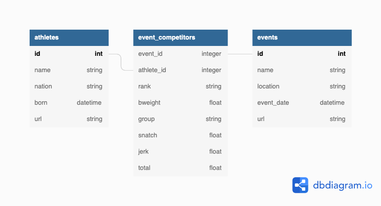

# Fetch and Parse Scraped Data Branch
# This app will directly render data that is scraped with iwf_ruby 
# (Not from a postgresql database!)


## Endpoint Summary:
```

```

## Prototype build:


## Full build (hopefully): 


